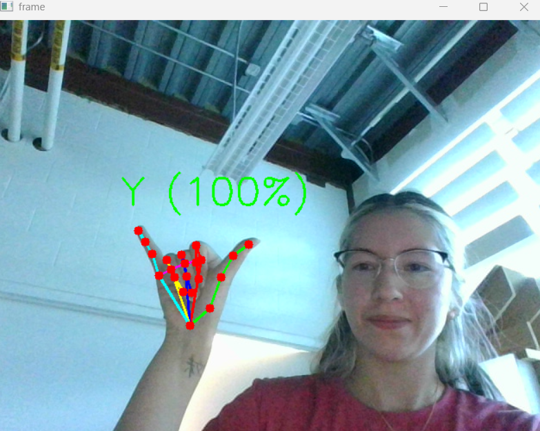

# Personal ASL Webcam Recognition Project
A real-time American Sign Language (ASL) hand landmark detection and letter prediction system built with Python, OpenCV, MediaPipe, and PyTorch. This project uses your webcam to detect hand landmarks and predict ASL letters using a CNN trained on the Sign MNIST dataset.

## Demo


---

## Features
- Real-time webcam feed with hand landmark overlay
- Detects up to 2 hands simultaneously
- Draws 21 landmarks and color-coded skeletal connections per finger
- Real-time ASL letter prediction with confidence score overlay for 1 hand
- Hand region cropping and preprocessing for model input
- Mirrored display for natural interaction
- Graceful exit via `q` key or closing the window

---

## Requirements
- Python 3.8+
- JupyterLab or Jupyter Notebook
- Webcam

### Python Dependencies
```
opencv-python
mediapipe
torch
torchvision
pandas
matplotlib
```

Install them with:
```bash
pip install opencv-python mediapipe --user
pip install torch torchvision --user
pip install pandas matplotlib --user
```

---

## Project Structure
```
ASL_live_detection/
├── README.md
├── hand_landmarker.task            # MediaPipe pre-trained hand landmark model (download separately)
├── utils.py                        # Model class definition (MyConvBlock)
├── Webcam.ipynb                    # Main webcam notebook
├── asl_augmentation.ipynb          # Model training notebook
├── asl_predictions.ipynb           # Model evaluation notebook
├── demo_images/                    # Demo screenshots
├── models/
│   ├── README.md                   # Model descriptions and results
│   ├── asl_model1.pth              # Original grayscale model
│   └── asl_model2.pth              # Color channel model (current)
└── test_data/
    ├── sign_mnist_train.csv        # Sign MNIST training data
    └── sign_mnist_valid.csv        # Sign MNIST validation data
```

---

## Setup

### 1. Clone or download the project
```bash
git clone https://github.com/samnbe/ASL_live_detection.git
cd ASL_live_detection
```

### 2. Install dependencies
```bash
pip install opencv-python mediapipe --user
pip install torch torchvision --user
pip install pandas matplotlib --user
```

### 3. Download the MediaPipe hand landmark model
Download `hand_landmarker.task` and place it in the project root folder:
```
https://storage.googleapis.com/mediapipe-models/hand_landmarker/hand_landmarker/float16/latest/hand_landmarker.task
```

### 4. Launch Jupyter
```bash
python -m jupyter lab
```

---

## Usage
Open `Webcam.ipynb` and run the cells in order:

| Cell | Description |
|------|-------------|
| Cell 1 | Imports and opens the webcam |
| Cell 2 | Model loading — loads trained ASL CNN from `asl_model2.pth` |
| Cell 3 | `landmarker_and_result` class — loads the MediaPipe model |
| Cell 4 | `draw_landmarks_on_image` drawing function |
| Cell 5 | `get_hand_crop` function — crops and preprocesses hand region for prediction |
| Cell 6 | Main webcam loop — runs detection, cropping, prediction and displays the feed |
| Cell 7 | Cleanup — releases webcam and closes windows |

> **Tip:** If the loop crashes or you interrupt it, manually run Cell 7 to release the webcam.

To quit the webcam feed:
- Press `q` with the OpenCV window in focus, or
- Click the `X` button on the webcam window

---

## How It Works
1. Each video frame is captured from the webcam and mirrored
2. The frame is converted from BGR (OpenCV format) to RGB (MediaPipe format)
3. The frame is passed asynchronously to the MediaPipe hand landmarker
4. When landmarks are detected, 21 key points are mapped onto the hand
5. Color-coded connections are drawn between landmarks per finger
6. The hand region is cropped using the landmark bounding box and resized to 28x28 — the color (RGB) image is passed directly to the model without grayscale conversion
7. The cropped image is passed through a CNN to predict the ASL letter
8. The predicted letter and confidence score are overlaid on the frame
9. The annotated frame is converted back to BGR and displayed

### Landmark Map
MediaPipe tracks 21 landmarks per hand:
```
Wrist:         0
Thumb:         1-4
Index finger:  5-8
Middle finger: 9-12
Ring finger:   13-16
Pinky:         17-20
```

---

## Roadmap
- [x] Real-time webcam hand landmark detection
- [x] Color-coded landmark skeleton per finger
- [x] ASL letter prediction with confidence score
- [x] Retrain model on color input (asl_model2)
- [ ] Improve prediction stability across frames
- [ ] Collect custom landmark dataset for improved accuracy
- [ ] Train landmark-based model using MediaPipe coordinates
- [ ] Word/phrase prediction from letter sequences

---

## Known Issues
- **Prediction instability** — the predicted letter can change rapidly even when the hand is held still, likely due to minor frame-to-frame variation in the cropped hand region
- **Limited letter accuracy** — asl_model2 correctly predicts approximately 8 out of 24 letters reliably across most test conditions. Note that J and Z are excluded from the dataset as they require motion
- **Training vs webcam data mismatch** — Sign MNIST images are tightly cropped, plain background, and taken under controlled conditions which are very different from a real webcam environment regardless of color
- **User ASL accuracy** — predictions may also be affected by inexperience with ASL hand positions
- On some systems, closing the OpenCV window with the `X` button may behave inconsistently — use `q` as a reliable fallback
- The first few frames may not show landmarks due to the async nature of MediaPipe's live stream mode
- `mediapipe.solutions` is deprecated in newer versions of MediaPipe (0.10+) — this project uses the newer `mediapipe.tasks` API

---

## References
- [MediaPipe Hand Landmarker Documentation](https://developers.google.com/mediapipe/solutions/vision/hand_landmarker)
- [MediaPipe Python Tasks API](https://developers.google.com/mediapipe/solutions/vision/hand_landmarker/python)
- [OpenCV Documentation](https://docs.opencv.org/)
- [Sign MNIST Dataset](https://www.kaggle.com/datasets/datamunge/sign-language-mnist)
- [NVIDIA Deep Learning Institute — Fundamentals of Deep Learning](https://www.nvidia.com/en-us/training/instructor-led-workshops/fundamentals-of-deep-learning/)
- [Finger Counting in Real-Time Video with OpenCV and MediaPipe — Medium](https://medium.com/@oetalmage16/a-tutorial-on-finger-counting-in-real-time-video-in-python-with-opencv-and-mediapipe-114a988df46a)